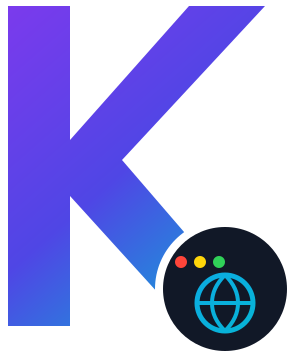

<div align="center">
  
  <br />
  <picture>
    <source media="(prefers-color-scheme: dark)" srcset="assets/brand-dark.svg">
    <source media="(prefers-color-scheme: light)" srcset="assets/brand.svg">
    
  </picture>
  <p><strong>Modern Chromium Embedded Framework for Compose Multiplatform Desktop &amp; Universal Java (Swing, AWT, SWT, JavaFX) Applications</strong></p>

  <p>
    <a href="https://central.sonatype.com/artifact/dev.daviante/kromium-compose"></a>
    <a href="https://kromium.daviante.dev"></a>
    <a href="https://kotlinlang.org"></a>
    <a href="https://adoptium.net"></a>
    <a href="https://www.jetbrains.com/lp/compose-multiplatform/"></a>
    <a href="LICENSE"></a>
    
  </p>
</div>

---

**Kromium** is an open-source, production-grade Chromium Embedded Framework (CEF) library built with **first-class multi-toolkit ergonomics** for **Compose Multiplatform Desktop** and the entire **Universal Java Desktop ecosystem (Swing, AWT, Eclipse SWT, JavaFX)** across Windows, macOS, and Linux.

Backed by **CEF 150** and the battle-tested JetBrains JCEF runtime, Kromium delivers on-demand bootstrapping, hardware-accelerated rendering, pure Java2D lightweight off-screen rendering (OSR), dynamic HiDPI scaling, virtual asset streaming via custom protocols (`app://`), asynchronous PDF export, declarative context menus, WebRTC permission interception, two-way JavaScript IPC bridges, and enterprise proxying.

> [!TIP]
> **Explore the Interactive Documentation Portal**: Visit **[kromium.daviante.dev](https://kromium.daviante.dev)** for interactive guides, API search, and live demos. Full technical documentation is also maintained in the **[`docs/`](docs/)** directory.

---

## 🌟 Highlights & Killer Features

* 🚀 **Universal Java Desktop Ecosystem**: Native declarative `@Composable KromiumView` for Compose Desktop, alongside first-class support for **Java Swing**, **Standard AWT**, **Eclipse SWT**, and **JavaFX** with zero Kotlin runtime dependencies required for JVM callers.
* 🎨 **Pure Java2D Lightweight OSR (Zero JOGL/OpenGL)**: Built-in `KromiumOSRPanel` draws Chromium byte buffers directly into Java2D double-buffered images, completely resolving Swing/JavaFX airspace and Z-ordering conflicts without external OpenGL native libraries.
* 🖥️ **Automatic HiDPI / Retina Scaling**: Dynamic scale factor detection (`AffineTransform.getScaleX()`) and real-time screen info synchronization guarantee razor-sharp web rendering across mixed 125%, 150%, and 200% displays on Windows, macOS, and Linux.
* 📦 **Zero-Bloat On-Demand Bootstrapping**: Ship ultra-compact 15–30 MB desktop installers. Kromium downloads, verifies with SHA-256, extracts, and caches the native platform JCEF runtime on first launch.
* 🌐 **Virtual Asset Streaming (`app://`)**: Stream local bundled HTML, CSS, JS, and WebAssembly directly from classpath resources or local directories via custom protocols without running a local HTTP server.
* 📄 **Async Vector PDF Export & Native Print Dialog**: Non-blocking document printing via Kotlin Coroutines (`printToPdf`) or Java `CompletableFuture` (`printToPdfAsync`), plus native OS print dialogs (`print()`).
* 🖱️ **Declarative Context Menu DSL**: Full control over right-click menus with turnkey shortcuts (`inspectElement()`, `copyLink()`, `searchWeb()`) and direct lambda callbacks without JCEF integer command bookkeeping.
* 🎙️ **WebRTC Media & Device Permissions**: Granular, origin-aware permission interception for Microphone, Camera, Screen Sharing, and Desktop Audio with in-memory session caching and strict security defaults.
* ⚡ **Two-Way JavaScript Bridge**: Coroutine and `CompletableFuture` JS evaluation, DOM extraction, and secure type-safe bidirectional IPC routing using `@JavascriptInterface`.
* 🏢 **Enterprise Proxy & Network Management**: Dynamic runtime proxy switching (PAC, WPAD, HTTPS TLS tunnels, SOCKS5 remote DNS), NTLM/Kerberos SSO, SSL error policies, and host locking.
* ☕ **Zero JVM Module Configuration**: Automatic runtime module opening eliminates manual `--add-opens` flags on Java 17, 21, and 23+.
* 🤖 **Zero-Dependency Headless Automation**: Automated offscreen rendering, DOM scraping, and screenshot capture without display servers or fragile OpenGL bindings.

---

## 📦 Installation

Add Kromium to your project dependencies:

### Gradle (Kotlin DSL)

```kotlin
repositories {
    mavenCentral()
    google()
    maven("https://maven.pkg.jetbrains.space/public/p/compose/dev")
}

dependencies {
    // For Compose Multiplatform Desktop:
    implementation("dev.daviante:kromium-compose:3.0.150-b11")

    // Or for Pure Java / Swing / Headless JVM:
    implementation("dev.daviante:kromium-core:3.0.150-b11")
}
```

### Gradle (Groovy DSL)

```groovy
repositories {
    mavenCentral()
    google()
    maven { url 'https://maven.pkg.jetbrains.space/public/p/compose/dev' }
}

dependencies {
    implementation 'dev.daviante:kromium-compose:3.0.150-b11'
    // or: implementation 'dev.daviante:kromium-core:3.0.150-b11'
}
```

### Apache Maven (`pom.xml` for Pure Java)

```xml
<dependency>
    <groupId>dev.daviante</groupId>
    <artifactId>kromium-core</artifactId>
    <version>3.0.150-b11</version>
</dependency>
```

---

## ⚡ 5-Minute Quickstart

### Kotlin (Compose Multiplatform Desktop)

```kotlin
import androidx.compose.foundation.layout.fillMaxSize
import androidx.compose.material3.MaterialTheme
import androidx.compose.runtime.LaunchedEffect
import androidx.compose.ui.Modifier
import androidx.compose.ui.window.Window
import androidx.compose.ui.window.application
import dev.daviante.kromium.compose.KromiumView
import dev.daviante.kromium.compose.rememberKromiumViewState
import dev.daviante.kromium.presentation.browser.Kromium

fun main() = application {
    LaunchedEffect(Unit) {
        if (!Kromium.isReady) Kromium.initialize()
    }

    Window(onCloseRequest = ::exitApplication, title = "Kromium Compose Browser") {
        MaterialTheme {
            val state = rememberKromiumViewState(initialUrl = "https://github.com/daviante/kromium")
            KromiumView(state = state, modifier = Modifier.fillMaxSize())
        }
    }
}
```

### Pure Java (Swing / Enterprise)

```java
import dev.daviante.kromium.domain.config.KromiumConfig;
import dev.daviante.kromium.presentation.browser.Kromium;
import dev.daviante.kromium.presentation.browser.KromiumBrowser;
import dev.daviante.kromium.presentation.browser.KromiumClient;
import javax.swing.JFrame;
import javax.swing.SwingUtilities;

public class QuickstartJava {
    public static void main(String[] args) {
        // 1. Initialize engine
        Kromium.initialize(KromiumConfig.builder().build());

        // 2. Create client and browser
        KromiumClient client = Kromium.newClient();
        KromiumBrowser browser = client.createBrowser("https://github.com/daviante/kromium");

        // 3. Mount UI component into standard JFrame
        SwingUtilities.invokeLater(() -> {
            JFrame frame = new JFrame("Kromium Java Browser");
            frame.setDefaultCloseOperation(JFrame.EXIT_ON_CLOSE);
            frame.setSize(1280, 800);
            frame.add(browser.getUiComponent());
            frame.setLocationRelativeTo(null);
            frame.setVisible(true);
        });
    }
}
```

---

## 🖥️ Universal Java Desktop Compatibility Matrix

Kromium is engineered to run seamlessly across every major JVM graphical toolkit. Choose the optimal rendering mode and container for your architecture:

| Framework / Toolkit | Recommended Mode | Underlying Technology | Primary Container | Sample Project |
|:---|:---|:---|:---|:---|
| **Compose Multiplatform** | **Windowed (GPU)** *(or OSR)* | Skia Hole-Punching via `SwingPanel` | `@Composable KromiumView` | [`:kromium-sample-compose`](kromium-sample-compose/) |
| **Java Swing** | **Lightweight OSR** *(Default)* | Pure Java2D `KromiumOSRPanel` | `JFrame` / `JPanel` | [`:kromium-sample-swing`](kromium-sample-swing/) |
| **Standard AWT** | **Heavyweight Windowed** | Native OS Window embedding | `java.awt.Frame` / `Panel` | [`:kromium-sample-awt`](kromium-sample-awt/) |
| **Eclipse SWT** | **Heavyweight Windowed** | Bridged AWT Composite (`SWT_AWT`) | `org.eclipse.swt.widgets.Shell` | [`:kromium-sample-swt`](kromium-sample-swt/) |
| **JavaFX** | **Lightweight OSR** | Embedded Swing wrapper (`SwingNode`) | `javafx.scene.Scene` / `SwingNode` | [`:kromium-sample-javafx`](kromium-sample-javafx/) |

> [!TIP]
> For complete setup instructions and code examples for each framework, see the [Universal Java Desktop Quickstart](docs/getting-started/quickstart-jvm.md).

---

### 1. 🌐 Virtual Local Asset Streaming (`app://`)

Serve local bundled web applications (HTML, CSS, JavaScript, React/Vue bundles, WebAssembly) securely via custom protocols without opening local HTTP ports or battling port-clash and CORS issues.

#### Kotlin (Compose)
```kotlin
import dev.daviante.kromium.presentation.browser.Kromium
import dev.daviante.kromium.presentation.scheme.KromiumCustomScheme
import dev.daviante.kromium.presentation.scheme.KromiumSchemeHandler

// Register 'app://' before initialize:
Kromium.registerCustomScheme(
    KromiumCustomScheme.create(
        schemeName = "app",
        domain = "myapp",
        handler = KromiumSchemeHandler.fromClasspath(
            resourcePathPrefix = "/web-app",
            spaFallback = "index.html"
        )
    )
)
Kromium.initialize()

// In Compose UI:
state.loadUrl("app://myapp/index.html")
```

#### Pure Java (Swing)
```java
import dev.daviante.kromium.presentation.browser.Kromium;
import dev.daviante.kromium.presentation.scheme.KromiumCustomScheme;
import dev.daviante.kromium.presentation.scheme.KromiumSchemeHandler;

// Register 'app://' protocol backed by classpath bundle:
Kromium.registerCustomScheme(
    KromiumCustomScheme.builder("app")
        .domain("myapp")
        .handler(KromiumSchemeHandler.fromClasspath("/web-app", "index.html"))
        .build()
);
Kromium.initialize();

browser.loadUrl("app://myapp/index.html");
```

📖 *Deep dive: [`docs/guides/asset-filtering-and-security.md`](docs/guides/asset-filtering-and-security.md)*

---

### 2. 📄 Async Vector PDF Export & Native Print Dialog

Export web pages into high-resolution, vector-crisp PDF documents asynchronously with precise layout control, or trigger the operating system's native print preview dialog.

#### Kotlin (Coroutines & Compose)
```kotlin
import dev.daviante.kromium.domain.model.KromiumPaperSize
import dev.daviante.kromium.domain.model.KromiumPdfMargins
import dev.daviante.kromium.domain.model.KromiumPdfSettings
import java.io.File

// Non-blocking suspending export:
val pdf: File = browser.printToPdf(
    targetFile = File("exports/invoice.pdf"),
    settings = KromiumPdfSettings(
        paperSize = KromiumPaperSize.A4,
        landscape = false,
        printBackground = true,
        margins = KromiumPdfMargins.fromMillimeters(10.0, 10.0, 10.0, 10.0),
        displayHeaderFooter = true,
        headerTemplate = "<span class=\"title\"></span>",
        footerTemplate = "<span class=\"pageNumber\"></span> of <span class=\"totalPages\"></span>"
    )
)

// Or open the native OS print dialog:
state.print() // in Compose
// or: browser.print()
```

#### Pure Java (CompletableFuture)
```java
import dev.daviante.kromium.domain.model.KromiumPaperSize;
import dev.daviante.kromium.domain.model.KromiumPdfMargins;
import dev.daviante.kromium.domain.model.KromiumPdfSettings;
import java.io.File;

KromiumPdfSettings settings = KromiumPdfSettings.builder()
    .paperSize(KromiumPaperSize.Letter)
    .printBackground(true)
    .margins(KromiumPdfMargins.None.INSTANCE)
    .build();

// Non-blocking async generation returning CompletableFuture<File>:
browser.printToPdfAsync(new File("exports/report.pdf"), settings)
    .thenAccept(file -> System.out.println("Generated PDF: " + file.getAbsolutePath()))
    .exceptionally(ex -> {
        System.err.println("PDF generation failed: " + ex.getMessage());
        return null;
    });

// Interactive native print dialog:
browser.print();
```

📖 *Deep dive: [`docs/reference/browser-and-client-api.md`](docs/reference/browser-and-client-api.md)*

---

### 3. 🖱️ Declarative Context Menu DSL & Turnkey Actions

Customize, add, or replace right-click context menus with high-level actions, custom callbacks, and built-in shortcuts without manual integer command ID plumbing.

#### Kotlin (Compose)
```kotlin
import dev.daviante.kromium.presentation.menu.KromiumContextMenuHandler

state.setContextMenu { ctx ->
    clear() // Remove default browser items (View Source, etc.)

    if (ctx.params.isLink()) {
        copyLink("Copy Target Link")
        separator()
    }

    if (ctx.params.hasSelection()) {
        copy("Copy")
        searchWeb() // Turnkey: "Search Google for '%s'"
        separator()
    }

    item("Custom App Action") { context ->
        println("User clicked on: ${context.params.pageUrl}")
    }

    subMenu("Developer") {
        inspectElement() // Opens DevTools inspecting clicked coordinates
        viewSource()
    }
}

// Or use ready-made turnkey presets:
state.contextMenuHandler = KromiumContextMenuHandler.minimalEditing(includeInspectElement = true)
state.contextMenuHandler = KromiumContextMenuHandler.devToolsOnly()
state.contextMenuHandler = KromiumContextMenuHandler.disabled()
```

#### Pure Java (Swing)
```java
import dev.daviante.kromium.presentation.menu.KromiumContextMenuHandler;

client.setContextMenuHandler((builder, ctx) -> {
    builder.clearDefaults();

    if (ctx.getParams().hasSelection()) {
        builder.copy();
        builder.searchWeb();
        builder.addSeparator();
    }

    builder.inspectElement();
    builder.addItem("Export Row", c -> exportSelection(c.getParams().getSelectionText()));
});

// Turnkey presets:
client.setContextMenuHandler(KromiumContextMenuHandler.minimalEditing(true));
client.setContextMenuHandler(KromiumContextMenuHandler.devToolsOnly());
```

📖 *Deep dive: [`docs/reference/handlers-and-events.md`](docs/reference/handlers-and-events.md)*

---

### 4. 🎙️ WebRTC Media Permissions & Session Caching

Intercept and evaluate web permission requests (Microphone, Camera, Screen Sharing, Desktop Audio) requested by web apps (e.g. Google Meet, Zoom, WebRTC video calling). Unhandled requests default strictly to `Deny`.

#### Kotlin (Compose)
```kotlin
import dev.daviante.kromium.presentation.handler.KromiumPermissionDecision
import dev.daviante.kromium.presentation.handler.KromiumPermissionHandler
import dev.daviante.kromium.presentation.handler.KromiumPermissionType

// Fine-grained selective permission filtering:
state.permissionHandler = KromiumPermissionHandler { request ->
    when {
        // Whitelist corporate domain for audio only
        request.origin == "https://meet.corp.internal" -> {
            KromiumPermissionDecision.grant(KromiumPermissionType.AUDIO_CAPTURE)
        }
        // Grant all permissions for trusted apps
        request.origin.startsWith("app://") -> KromiumPermissionDecision.GRANT
        // Securely deny all untrusted sites
        else -> KromiumPermissionDecision.DENY
    }
}

// Or use ready-made turnkey domain presets:
state.permissionHandler = KromiumPermissionHandler.forOrigins("meet.google.com", "zoom.us")

// Programmatically revoke remembered session permissions:
state.clearPermissionCache()
```

#### Pure Java (Swing)
```java
import dev.daviante.kromium.presentation.handler.KromiumPermissionDecision;
import dev.daviante.kromium.presentation.handler.KromiumPermissionHandler;
import dev.daviante.kromium.presentation.handler.KromiumPermissionType;

client.setPermissionHandler(request -> {
    if (request.hasAudio() && "https://meet.company.com".equals(request.getOrigin())) {
        return KromiumPermissionDecision.grant(KromiumPermissionType.AUDIO_CAPTURE);
    }
    return KromiumPermissionDecision.DENY;
});

// Turnkey origin allowlist:
client.setPermissionHandler(KromiumPermissionHandler.forOrigins("meet.google.com", "zoom.us"));

// Revoke session cache:
client.clearPermissionCache();
```

📖 *Deep dive: [`docs/reference/handlers-and-events.md`](docs/reference/handlers-and-events.md)*

---

### 5. ⚡ Two-Way JavaScript Bridge & Typed DOM Evaluation

Execute arbitrary JavaScript with coroutine and `CompletableFuture` return values, or bind native JVM objects to JavaScript's `window` object for bidirectional communication.

#### Kotlin (Coroutines & Compose)
```kotlin
import dev.daviante.kromium.presentation.js.JavascriptInterface

// 1. Evaluate JavaScript asynchronously:
val headingText: String? = browser.evaluateJavascript("document.querySelector('h1').innerText")

// 2. Register native object into JavaScript window context:
class NativeBridge {
    @JavascriptInterface
    fun onUserAction(payload: String) {
        println("Received from web page: $payload")
    }
}

browser.registerJsInterface(NativeBridge(), "desktopApp")
// In web page: window.desktopApp.onUserAction("Hello from JS!")
```

#### Pure Java (CompletableFuture)
```java
import dev.daviante.kromium.presentation.js.JavascriptInterface;

// 1. Evaluate JavaScript returning CompletableFuture<String>:
browser.evaluateJavascript("document.title")
    .thenAccept(title -> System.out.println("Page title is: " + title));

// 2. Register native Java bridge object:
public class NativeBridge {
    @JavascriptInterface
    public void notify(String message) {
        System.out.println("Message from JS: " + message);
    }
}

browser.registerJsInterface(new NativeBridge(), "desktopApp");
```

📖 *Deep dive: [`docs/guides/javascript-and-dom.md`](docs/guides/javascript-and-dom.md)*

---

### 6. 🤖 Headless Mode & Automated Screenshot Capture

Perform server-side web scraping, DOM analysis, and automated screenshot capture in offscreen headless environments without requiring OpenGL/JOGL or display servers.

#### Kotlin & Pure Java
```kotlin
// 1. Initialize headless browser instance:
val headlessBrowser = client.createBrowser(
    url = "https://example.com",
    isOffScreenRendered = true
)

// 2. Capture vector-rendered raster screenshot:
val image: java.awt.image.BufferedImage? = headlessBrowser.takeScreenshot()
if (image != null) {
    javax.imageio.ImageIO.write(image, "PNG", java.io.File("screenshot.png"))
}
```

📖 *Deep dive: [`docs/guides/headless-and-automation.md`](docs/guides/headless-and-automation.md)*

---

## 🪟 Native Window Chrome & Custom Tab Strips

Optional, flag-enabled helper utilities for integrating custom tab strips with native OS titlebars and macOS traffic lights without imposing rigid defaults or altering standard window behavior.

#### Kotlin Compose Multiplatform
```kotlin
import dev.daviante.kromium.compose.chrome.macTrafficLightsPadding
import dev.daviante.kromium.compose.chrome.MacTrafficLightsSpacer

// In your custom TabStrip / Header composable:
Row(
    modifier = Modifier
        .fillMaxWidth()
        // Automatically applies padding on macOS only when enabled; 0.dp otherwise
        .macTrafficLightsPadding(enabled = true, width = 76.dp)
) {
    // Custom tab items here...
}

// Or use a platform-adaptive spacer:
Row(modifier = Modifier.fillMaxWidth()) {
    MacTrafficLightsSpacer(enabled = true, width = 76.dp)
    // Custom tabs...
}
```

#### Pure Java & Swing
```java
import dev.daviante.kromium.presentation.chrome.KromiumChromeConfig;
import dev.daviante.kromium.presentation.chrome.KromiumWindowChrome;

// 1. Configure macOS full window content (merging tab strip with titlebar)
KromiumChromeConfig config = KromiumChromeConfig.builder()
    .enabled(true)
    .macTrafficLightsWidth(80)
    .transparentTitleBar(true)
    .hideWindowTitle(true)
    .build();

KromiumWindowChrome.apply(frame, config);

// 2. Enable window dragging & double-click maximize on custom tab strip
KromiumWindowChrome.installWindowDragger(tabStripPanel, frame);
```

---

## 📚 Modular Documentation Hub

Comprehensive, in-depth documentation organized according to the **Diátaxis framework** is maintained in the **[`docs/`](docs/)** directory:

| Category | Guides & References | Key Topics |
|:---|:---|:---|
| **🚀 Getting Started** | [Installation Guide](docs/getting-started/installation.md)<br/>[Compose Quickstart](docs/getting-started/quickstart-compose.md)<br/>[Swing JVM Quickstart](docs/getting-started/quickstart-jvm.md) | Repository setup, multi-module configurations, Gradle dependencies, first browser window. |
| **🏛️ Core Concepts** | [Architecture](docs/core-concepts/architecture.md)<br/>[State & Lifecycle](docs/core-concepts/state-and-lifecycle.md)<br/>[Security & Privacy](docs/core-concepts/security-and-privacy.md) | Bootstrap pipeline, multi-process Chromium architecture, `KromiumState` flow, and telemetry suppression. |
| **📖 Guides** | [Compose UI Integration](docs/guides/compose-ui.md)<br/>[Navigation & History](docs/guides/navigation-and-history.md)<br/>[JavaScript & DOM](docs/guides/javascript-and-dom.md)<br/>[Network & Proxies](docs/guides/network-and-proxies.md) | Multi-tab UI, navigation controls, coroutine JS execution, IPC routers, and enterprise proxy configuration. |
| **📖 Guides (Cont.)** | [Asset Filtering & Schemes](docs/guides/asset-filtering-and-security.md)<br/>[Cookie Management](docs/guides/cookie-management.md)<br/>[Downloads & Dialogs](docs/guides/downloads-and-dialogs.md)<br/>[Headless & Automation](docs/guides/headless-and-automation.md) | Virtual asset streaming, ad blocking, host locking, async cookie store, modal dialogs, and off-screen scraping. |
| **📋 API Reference** | [Configuration (`KromiumConfig`)](docs/reference/configuration.md)<br/>[Browser & Client API](docs/reference/browser-and-client-api.md)<br/>[Handlers & Events](docs/reference/handlers-and-events.md)<br/>[Exceptions & Logging](docs/reference/exceptions-and-logging.md) | Complete property catalogs, method signatures, composite multiplexers, and pluggable logging. |
| **📦 Deployment** | [Packaging & Distribution](docs/deployment/packaging-and-distribution.md)<br/>[Platform Considerations](docs/deployment/platform-specifics.md)<br/>[Troubleshooting & FAQ](docs/deployment/troubleshooting-and-faq.md) | Desktop installers (MSI, DMG, DEB), ProGuard/R8 rules, macOS framework symlinks, and Linux dependencies. |

Visit the master sitemap at **[`docs/README.md`](docs/README.md)**.

---

## 💻 Supported Platforms & OS Requirements

| Operating System | Architectures | Minimum Version | Prerequisites |
|:---|:---|:---|:---|
| **Windows** | x64 (64-bit) | Windows 10 / 11, Server 2019+ | [Visual C++ 2015–2022 Redistributable](https://aka.ms/vs/17/release/vc_redist.x64.exe) |
| **macOS** | ARM64 (Apple Silicon) & Intel x64 | macOS 11.0 (Big Sur)+ | None *(Universal binaries resolved automatically)* |
| **Linux** | x64 & ARM64 | Ubuntu 20.04+, Debian 11+, Fedora 36+ | Standard desktop X11/GTK libraries (`libnss3`, `libasound2`, `libdrm2`) |

*Minimum Java Runtime: **Java 17 LTS** (Java 21 LTS Recommended).*

---

## 🚀 Running the Showcase Demos

The repository includes ready-to-run desktop browser applications demonstrating every framework integration:

### 1. Compose Multiplatform Browser Demo
```bash
./gradlew :kromium-sample-compose:run
```
*Features multi-tab browsing, DevTools REPL, live canvas animation, and visible text extraction.*

### 2. Pure Java & Swing Showcase Demo
```bash
./gradlew :kromium-sample-swing:run
```
*Features lightweight pure Java2D OSR rendering, modern FlatLaf dark theme, download manager dialog, proxy switching, and native print preview.*

### 3. Standard AWT Heavyweight Browser Demo
```bash
./gradlew :kromium-sample-awt:run
```
*Demonstrates native heavyweight `java.awt.Frame` embedding with functional navigation toolbar and clean lifecycle disposal.*

### 4. Eclipse SWT Bridged Browser Demo
```bash
./gradlew :kromium-sample-swt:run
```
*Demonstrates embedding CEF inside an Eclipse SWT application via `SWT_AWT.new_Frame` with full toolbar controls and SWT event loop handling.*

### 5. JavaFX Bridged OSR Browser Demo
```bash
./gradlew :kromium-sample-javafx:run
```
*Demonstrates embedding lightweight OSR Chromium inside a JavaFX `Scene` via `SwingNode` with dynamic HiDPI scaling, scene resize synchronization, and navigation controls.*

---

## ⚖️ License

Kromium is open-source software licensed under the **[Apache License, Version 2.0](LICENSE)**.
Commercial friendly, royalty-free, and compliant with standard patent and distribution requirements.
