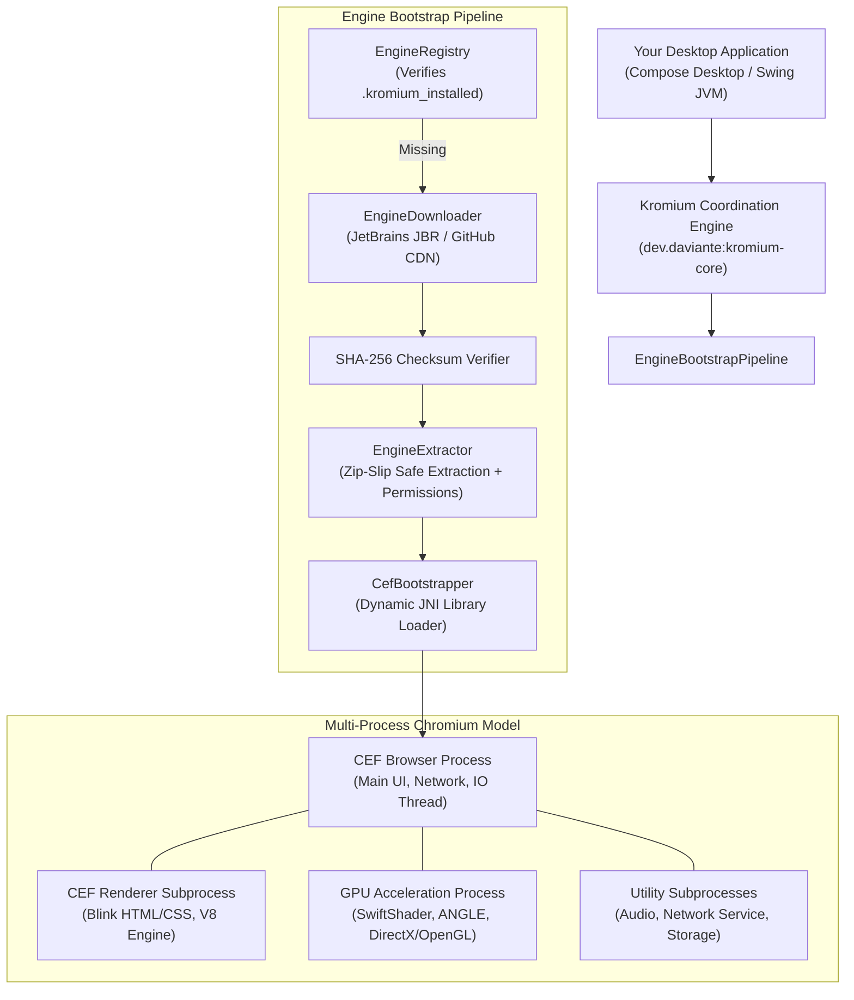
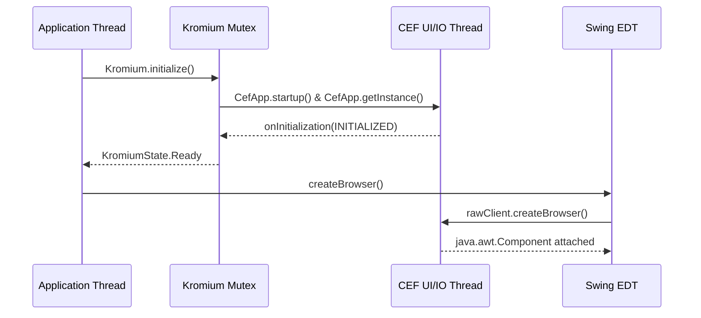

# Engine Architecture & Bootstrapping

[Documentation Hub](../README.md) &bull; **Core Concepts** &bull; Architecture

---

## 🏛️ High-Level System Architecture

Kromium bridges Kotlin applications with the Chromium Embedded Framework (CEF) by coordinating dynamic runtime installation, JNI native library resolution, multi-process lifecycle supervision, and Java AWT/Swing rendering pipelines.

---

## 📦 Dynamic Engine Provisioning

Traditional CEF wrappers require bundling 200MB+ of native platform binaries directly into your application installer for every target operating system.

Kromium solves this via **On-Demand Engine Provisioning**:
1. **Platform Fingerprinting**: `PlatformDetector` identifies the OS (Windows, macOS, Linux) and CPU architecture (x64, ARM64 Apple Silicon).
2. **Release Resolution**: Queries the official JetBrains JCEF release catalog (or your enterprise mirror via `customBundleUrl`).
3. **Checksum Verification**: Downloads the matching archive and verifies its cryptographic SHA-256 hash.
4. **Hardened Extraction**: `EngineExtractor` extracts the bundle with strict Zip-Slip protection, restores POSIX execution permissions (`chmod +x`), and generates required macOS Framework symlinks.
5. **Persistence**: Marks the engine as permanently installed via `.kromium_installed`. Future launches bootstrap in < 50ms without any network calls.

---

## ⚙️ Native Library Loading (`CefBootstrapper`)

Once the engine files are verified on disk, `CefBootstrapper` prepares the JVM environment:

### Dynamic System Properties
* `ALT_CEF_FRAMEWORK_DIR`: Points to the folder containing `libcef` (`Chromium Embedded Framework.framework` on macOS).
* `ALT_CEF_HELPER_APP_DIR`: Points to the helper subprocess executable (`jcef_helper` or `jcef Helper.app`).
* `ALT_JCEF_LIB_DIR`: Points to the directory containing `jcef.dll`, `libjcef.dylib`, or `libjcef.so`.
* `jcef_app_preinit_any=true`: Allows JCEF to perform early native initialization on any thread, preventing deadlocks when bootstrapping off the Swing Event Dispatch Thread (EDT).

### Native Library Link Order
`CefBootstrapper` loads native binaries into the host JVM in strict topological order:
1. **Java AWT Native Peer (`jawt`)**: Preloads `jawt.dll` / `libjawt.so` / `libjawt.dylib` from the active JDK `java.home`.
2. **GPU & Shader Libraries**: Preloads ANGLE/SwiftShader acceleration binaries (`EGL`, `GLESv2`, `vk_swiftshader`) unless `--disable-gpu` is active.
3. **Chromium Core Framework**:
   * Windows: Preloads `chrome_elf.dll`, then `libcef.dll`.
   * Linux: Preloads `libcef.so`.
   * macOS: Dynamic loader resolves the nested framework bundle.
4. **CEF JNI Bridge (`jcef`)**: Links the Java-to-C++ JNI adapter.

---

## 🧵 Threading Model

Chromium and Swing operate on separate, specialized event loops. Kromium coordinates these safely:

* **Application Dispatcher**: Coroutines run on `Dispatchers.IO` or `Dispatchers.Default`.
* **CEF Thread**: Handles network IO, Blink rendering, and Chromium message loops.
* **Swing EDT**: Handles user input events, focus, painting, and window resizing.
