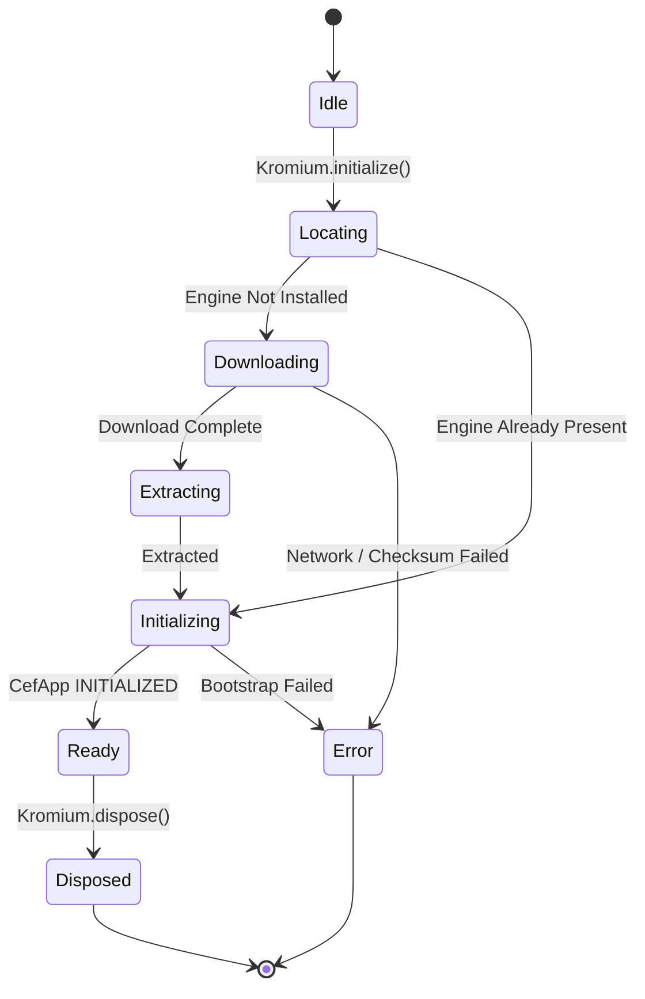

# State & Lifecycle Management

[Documentation Hub](../README.md) &bull; **Core Concepts** &bull; State & Lifecycle

---

## 🔄 The `KromiumState` Machine

The Kromium engine state is exposed as a reactive `StateFlow<KromiumState>` on the `Kromium` singleton. This allows Compose applications to re-render dynamically as the engine transitions through its lifecycle:



### State Hierarchy

```kotlin
sealed interface KromiumState {
    /** Engine is uninitialized and awaiting Kromium.initialize(). */
    data object Idle : KromiumState

    /** Inspecting local filesystem to determine if binaries are already present. */
    data object Locating : KromiumState

    /** Downloading the engine archive from JetBrains releases or enterprise mirror. */
    data class Downloading(val progress: DownloadProgress) : KromiumState

    /** Decompressing and extracting archive binaries to the installDir. */
    data object Extracting : KromiumState

    /** Linking native libraries (JAWT, libcef, jcef) into the JVM. */
    data object Initializing : KromiumState

    /** Engine is fully operational. Clients and browsers can now be created. */
    data object Ready : KromiumState

    /** An unrecoverable exception occurred during initialization. */
    data class Error(val cause: Throwable) : KromiumState

    /** Engine has been gracefully shut down. No further operations permitted. */
    data object Disposed : KromiumState
}
```

---

## 🔒 Concurrency & Idempotency

### Mutex-Guarded Initialization
`Kromium.initialize()` is strictly **re-entrant and idempotent**:
* If multiple coroutines call `Kromium.initialize()` simultaneously, the first caller acquires an internal `Mutex` and initiates the bootstrap pipeline.
* Subsequent callers await completion of the active initialization without launching redundant downloads or duplicate CEF processes.
* Calling `Kromium.initialize()` when already in `KromiumState.Ready` returns immediately.

```kotlin
// Safe to call from anywhere in your codebase
suspend fun ensureBrowserReady() {
    if (!Kromium.isReady) {
        Kromium.initialize()
    }
}
```

### Awaiting Ready State
To suspend until the browser engine is ready to create instances:

```kotlin
// Suspends until Kromium reaches Ready state, then returns a fresh client
val client = Kromium.awaitClient()

// Or directly instantiate an initial browser:
val browser = Kromium.awaitBrowser("https://github.com")
```

---

## 🛑 Clean Shutdown & Disposal

When shutting down your application or hot-reloading:

### 1. Disposing Individual Browsers
Always dispose of browser instances when their container window closes to immediately free native off-screen buffers and GPU texture memory:

```kotlin
browser.dispose()
client.dispose()
```

In Compose Desktop, `@Composable KromiumView` **automatically disposes** the browser and native peers when leaving composition.

### 2. Disposing the Engine
To cleanly terminate Chromium subprocesses (`jcef_helper`), flush cookie stores, and unload native handles:

```kotlin
Kromium.dispose()
```

Kromium also registers a JVM runtime shutdown hook (`Runtime.getRuntime().addShutdownHook`) to automatically execute disposal if the application terminates unexpectedly.
