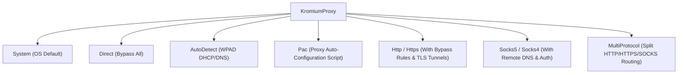

# Network Interception & Enterprise Proxies

[Documentation Hub](../README.md) &bull; **Guides** &bull; Network & Proxies

---

## 🌐 Network Request Interception

Intercept, inspect, block, or modify every HTTP and sub-resource request initiated by the browser:

```kotlin
client.requestInterceptor = KromiumRequestInterceptor { request ->
    println("URL: ${request.url} | Method: ${request.method} | IsNav: ${request.isNavigation}")

    // 1. Block tracking scripts & analytic pixels
    if (request.url.contains("google-analytics.com") || request.url.contains("doubleclick.net")) {
        return@KromiumRequestInterceptor true // Cancel request immediately
    }

    // 2. Inject custom authorization or session headers
    if (request.url.startsWith("https://api.mycompany.com")) {
        request.headers["Authorization"] = "Bearer token_abc123"
        request.headers["X-Client-Platform"] = "Kromium-Desktop"
    }

    false // Allow request to proceed
}
```

---

## 🏢 Enterprise & Small Business Proxy Strategies

Kromium supports the full spectrum of corporate, enterprise, and privacy proxy configurations:



### 1. HTTP / Secure HTTPS Proxy with Bypass Rules
```kotlin
Kromium.initialize {
    proxy = KromiumProxy.Http(
        host = "proxy.corp.internal",
        port = 8080,
        username = "domain\\user",
        password = "SecurePassword123",
        isSecure = false, // Set to true for https:// TLS proxy tunnels (Zero-Trust)
        bypassList = listOf("<local>", "127.0.0.1", "*.internal.corp", "10.0.0.0/8")
    )
}
```

### 2. SOCKS5 with Remote DNS Leak Protection
```kotlin
Kromium.initialize {
    proxy = KromiumProxy.Socks5(
        host = "127.0.0.1",
        port = 1080,
        username = "socks_user",
        password = "socks_pass",
        remoteDns = true, // Resolves DNS on the proxy to prevent local DNS leakage
        bypassList = listOf("localhost", "127.0.0.1")
    )
}
```

### 3. Proxy Auto-Configuration (PAC) Script
Standard in corporate intranets where routing logic is distributed via `.pac` files:

```kotlin
Kromium.initialize {
    proxy = KromiumProxy.Pac("http://pac.corp.internal/wpad.dat")
}
```

### 4. WPAD Auto-Discovery
```kotlin
Kromium.initialize {
    proxy = KromiumProxy.AutoDetect
}
```

### 5. Multi-Protocol Split Routing
Route HTTP traffic through one proxy and HTTPS traffic through a secure egress gateway:

```kotlin
Kromium.initialize {
    proxy = KromiumProxy.MultiProtocol(
        http = "http://http-proxy.corp:8080",
        https = "https://secure-egress.corp:8443",
        socks = "socks5://socks.corp:1080",
        bypassList = listOf("<local>", "*.corp")
    )
}
```

---

## 🔑 Automatic Proxy Authentication (HTTP 407)

When credentials are provided in `KromiumProxy.Http` or `KromiumProxy.Socks5`, Kromium **automatically supplies them** when challenged with an `HTTP 407 (Proxy Authentication Required)` response. No custom listeners are required.

To supply dynamic or interactive credentials at runtime, attach an `authListener`:

```kotlin
client.authListener = KromiumAuthListener { req ->
    if (req.isProxy) {
        KromiumAuthResponse.Proceed(
            username = "domain\\myuser",
            password = "SecretPassword"
        )
    } else {
        KromiumAuthResponse.Cancel
    }
}
```

---

## ⚡ Dynamic Runtime Proxy Switching

In enterprise desktop applications, users frequently switch network environments (e.g. connecting to a corporate VPN, switching Wi-Fi networks, or changing proxy profiles in App Settings).

Kromium allows you to update the proxy configuration at runtime **without disposing browsers or restarting the engine**:

```kotlin
// Change proxy globally across all active browser windows:
val result = Kromium.setProxy(
    KromiumProxy.Http(
        host = "vpn-gateway.internal",
        port = 8443,
        isSecure = true
    )
)

if (result.isSuccess) {
    println("Switched to VPN proxy successfully!")
} else {
    println("Failed to update proxy: ${result.exceptionOrNull()?.message}")
}
```

---

## 🔐 Integrated Windows Authentication (NTLM / Kerberos SSO)

To support seamless Single Sign-On (SSO) in Active Directory environments without prompting for credentials:

```kotlin
Kromium.initialize {
    // Whitelist servers permitted for NTLM / Kerberos Negotiate
    authServerAllowlist = listOf("*.corp.internal", "sso.company.com")

    // Whitelist servers permitted for Kerberos credential delegation
    authNegotiateDelegateAllowlist = listOf("sso.company.com")
}
```
